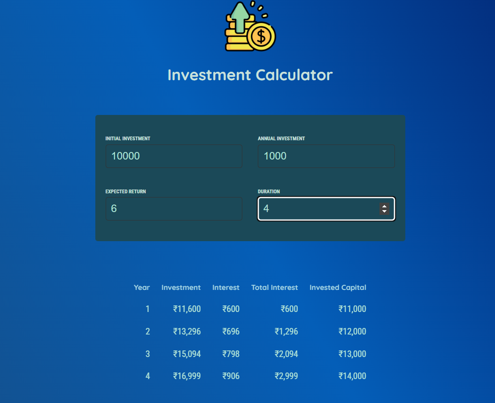

# investiCalc-react

investiCalc-react is a web application designed to help users calculate and analyze investment returns with ease.

## Table of Contents

- [Features](#features)
- [Demo](#demo)
- [Project Structure](#project-structure)
- [Project Components](#project-components)
- [Installation](#installation)
- [Usage](#usage)

## Features

- User-friendly interface for inputting investment details
- Real-time calculation of potential returns
- Visualization of investment growth over time

## Demo



## Project Components

- **Header**: Displays the application title and logo. Implemented in `Header.js`.
- **User**: Collects user input for initial investment, annual investment, expected return, and duration. Implemented in `User.js`.
- **Results**: Displays the calculated investment results in a table format. Implemented in `Results.js`.

### Utility Functions

- **calculateInvestmentResults**: Calculates the investment growth over time. Implemented in `calculateInvestmentResults.js`.
- **formatter**: Formats numbers as currency. Implemented in `formatter.js`.

## Installation

To set up the project locally, follow these steps:

1. Clone the repository:
   ```bash
   git clone https://github.com/arun-357/investiCalc-react.git
   ```

2. Navigate to the project directory:
   ```bash
   cd react-essentials-practice
   ```
3. Run 
   ```bash
   npm install && npm run dev
   ```